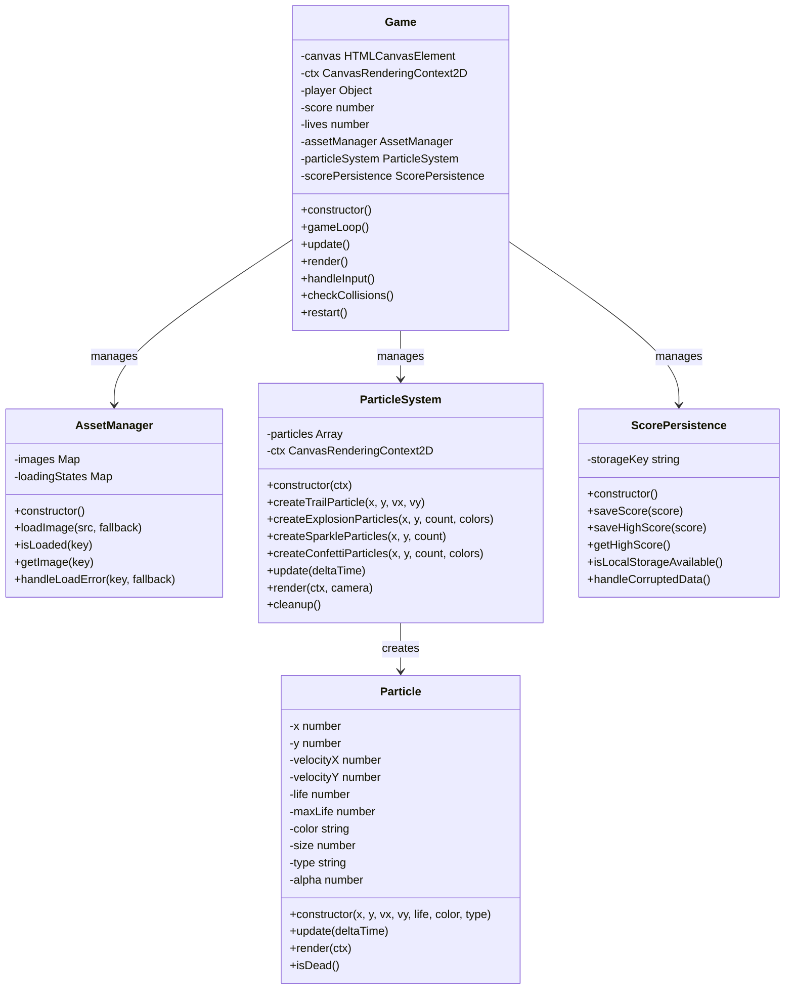

# Design Document - Super Kiro World Game Enhancements

## Overview

This design document outlines the enhancement of Super Kiro World with visual polish, score persistence, and improved character representation. The enhancements will transform the existing basic platformer into a more engaging experience by integrating the Kiro logo as the player character, implementing a comprehensive particle system for visual effects, and adding persistent score tracking.

The current game features a flying character mechanic with platform-based level design, collectible systems, and basic collision detection. These enhancements will build upon this foundation to create a more polished and branded gaming experience.

## Architecture

### Current System Architecture
The game follows a single-class architecture with the `Game` class managing all game systems:
- Input handling and player controls
- Physics and collision detection
- Rendering pipeline using HTML5 Canvas
- Game state management
- Camera system with smooth following

### Enhanced Architecture
The enhancements will extend the existing architecture with:

1. **Asset Management System**: Handle loading and rendering of the Kiro logo sprite
2. **Particle System**: Manage creation, animation, and cleanup of visual effects
3. **Persistence Layer**: Handle local storage operations for score data
4. **Enhanced Rendering Pipeline**: Support sprite rendering and particle effects

### System Integration
- The particle system will integrate with existing collision detection
- Asset management will replace current rectangle-based player rendering
- Persistence layer will extend current score tracking
- All systems will maintain the existing 60 FPS performance target

### Architecture Diagram



### Interaction Flow

1. **Game Initialization**: Game creates instances of AssetManager, ParticleSystem, and ScorePersistence
2. **Asset Loading**: AssetManager loads Kiro logo, provides fallback if loading fails
3. **Game Loop**: Game coordinates updates between all systems
4. **Player Movement**: Game detects movement and triggers ParticleSystem to create trail particles
5. **Collision Events**: Game collision detection triggers ParticleSystem explosion effects
6. **Score Events**: Game score changes trigger ScorePersistence saves and potential confetti effects
7. **Rendering**: Game orchestrates rendering of player sprite (via AssetManager) and particles (via ParticleSystem)

## Components and Interfaces

### Asset Manager
```javascript
class AssetManager {
    constructor()
    loadImage(src, fallback)
    isLoaded(key)
    getImage(key)
    handleLoadError(key, fallback)
}
```

**Responsibilities:**
- Load and cache the Kiro logo image
- Provide fallback rendering for loading failures
- Manage image scaling and proportions

### Particle System
```javascript
class ParticleSystem {
    constructor(ctx)
    createTrailParticle(x, y, velocityX, velocityY)
    createExplosionParticles(x, y, count, colors)
    createSparkleParticles(x, y, count)
    createConfettiParticles(x, y, count, colors)
    update(deltaTime)
    render(ctx, camera)
    cleanup()
}

class Particle {
    constructor(x, y, velocityX, velocityY, life, color, type)
    update(deltaTime)
    render(ctx)
    isDead()
}
```

**Responsibilities:**
- Generate and manage different particle types
- Handle particle physics and animation
- Optimize performance through efficient cleanup
- Render particles with proper layering

### Score Persistence Manager
```javascript
class ScorePersistence {
    constructor()
    saveScore(score)
    saveHighScore(score)
    getHighScore()
    isLocalStorageAvailable()
    handleCorruptedData()
}
```

**Responsibilities:**
- Save current scores to local storage
- Manage high score tracking and updates
- Handle storage unavailability gracefully
- Recover from corrupted data scenarios

### Enhanced Player System
The existing player object will be extended with:
- Sprite rendering capabilities
- Particle trail generation tracking
- Collision event particle triggers

## Data Models

### Particle Data Structure
```javascript
{
    x: number,           // Position X
    y: number,           // Position Y
    velocityX: number,   // Horizontal velocity
    velocityY: number,   // Vertical velocity
    life: number,        // Remaining lifetime (0-1)
    maxLife: number,     // Initial lifetime
    color: string,       // Particle color
    size: number,        // Particle size
    type: string,        // 'trail', 'explosion', 'sparkle', 'confetti'
    alpha: number        // Transparency (0-1)
}
```

### Score Data Structure
```javascript
{
    currentScore: number,
    highScore: number,
    lastPlayed: timestamp,
    gamesPlayed: number
}
```

### Asset Data Structure
```javascript
{
    kiroLogo: {
        image: HTMLImageElement,
        loaded: boolean,
        width: number,
        height: number,
        scaleFactor: number
    }
}
```

## Correctness Properties

*A property is a characteristic or behavior that should hold true across all valid executions of a system-essentially, a formal statement about what the system should do. Properties serve as the bridge between human-readable specifications and machine-verifiable correctness guarantees.*
### Property Reflection

After reviewing all identified testable properties, several can be consolidated to eliminate redundancy:

- Properties 1.2 and 1.3 (logo integrity during movement and collisions) can be combined into a single comprehensive property about sprite consistency
- Properties 3.2 and 4.5 (particle lifecycle management) share similar cleanup logic and can be unified
- Properties 4.1 and 4.2 (collision-based particle generation) can be combined into one property covering all collision types
- Properties 5.2 and 6.3 (particle animation behavior) can be consolidated into a general particle physics property

### Correctness Properties

**Property 1: Sprite rendering consistency**
*For any* game state where the Kiro logo is loaded, the player character should always render using the image sprite with preserved aspect ratio and scale, regardless of position or collision state
**Validates: Requirements 1.2, 1.3**

**Property 2: Score persistence round trip**
*For any* valid score value, storing it to local storage and then retrieving it should return the same score value
**Validates: Requirements 2.1, 2.3**

**Property 3: High score monotonicity**
*For any* sequence of scores, the stored high score should never decrease and should always reflect the maximum score achieved
**Validates: Requirements 2.2**

**Property 4: Movement-based trail generation**
*For any* player movement with non-zero velocity, trail particles should be generated behind the character with appropriate Kiro brand colors
**Validates: Requirements 3.1, 3.4**

**Property 5: Particle lifecycle management**
*For any* created particle, its life value should decrease over time until it reaches zero, at which point it should be removed from the particle system
**Validates: Requirements 3.2, 4.5**

**Property 6: Movement cessation stops trail generation**
*For any* game state where player velocity is zero, no new trail particles should be created
**Validates: Requirements 3.3**

**Property 7: Collision-triggered particle generation**
*For any* collision event between the player and game objects, explosion particles should be generated at the collision coordinates with properties appropriate to the collision type
**Validates: Requirements 4.1, 4.2**

**Property 8: Particle physics behavior**
*For any* explosion or confetti particle, it should exhibit outward motion from its creation point with decreasing life values and appropriate physics simulation
**Validates: Requirements 4.3, 6.3**

**Property 9: Area-based sparkle generation**
*For any* designated obstacle area, sparkle particles should be generated when the player character is within the area boundaries and cease when the player exits
**Validates: Requirements 5.1, 5.4**

**Property 10: Sparkle particle visual properties**
*For any* sparkle particle, it should use bright, contrasting colors and exhibit twinkling animation behavior
**Validates: Requirements 5.2, 5.3**

**Property 11: High score celebration trigger**
*For any* score that exceeds the current high score, a confetti celebration effect should be triggered with multiple Kiro brand colors
**Validates: Requirements 6.1, 6.2**

**Property 12: Confetti celebration cleanup**
*For any* confetti celebration, all confetti particles should be cleared from the system after the celebration duration completes
**Validates: Requirements 6.4**

## Error Handling

### Asset Loading Failures
- **Kiro Logo Loading**: Implement graceful fallback to colored rectangle rendering when image fails to load
- **Error Recovery**: Retry loading mechanism with exponential backoff
- **User Feedback**: Visual indicator when running in fallback mode

### Local Storage Issues
- **Storage Unavailability**: Detect when localStorage is disabled and switch to session-only mode
- **Quota Exceeded**: Handle storage quota limits by clearing old data
- **Data Corruption**: Validate stored data format and reset to defaults when corrupted
- **Cross-Browser Compatibility**: Handle different localStorage implementations

### Particle System Performance
- **Memory Management**: Automatic cleanup of expired particles to prevent memory leaks
- **Performance Degradation**: Dynamic particle count adjustment based on frame rate
- **Rendering Optimization**: Batch particle rendering operations for efficiency

### Collision Detection Edge Cases
- **Rapid Collisions**: Prevent particle spam during continuous collision states
- **Boundary Conditions**: Handle particles created at screen edges
- **System Overload**: Limit maximum concurrent particles to maintain performance

## Testing Strategy

### Dual Testing Approach

The testing strategy employs both unit testing and property-based testing to ensure comprehensive coverage:

**Unit Testing Focus:**
- Specific examples demonstrating correct behavior
- Edge cases and error conditions
- Integration points between systems
- Asset loading scenarios
- Local storage operations

**Property-Based Testing Focus:**
- Universal properties across all valid inputs
- Particle system behavior with random parameters
- Score persistence with various score values
- Collision detection with random positions and velocities

**Property-Based Testing Library:**
We will use **fast-check** for JavaScript property-based testing, configured with a minimum of 100 iterations per test to ensure thorough coverage of the input space.

**Test Tagging Requirements:**
- Each property-based test must include a comment with the format: **Feature: game-enhancements, Property {number}: {property_text}**
- Each test must reference the specific correctness property from this design document
- Tests must validate the universal quantification ("for any") aspect of each property

**Testing Implementation Guidelines:**
- Property tests should generate realistic game scenarios (valid positions, velocities, scores)
- Unit tests should cover specific examples like "loading Kiro logo with valid image file"
- Integration tests should verify end-to-end workflows like "score achievement → storage → retrieval"
- Performance tests should validate 60 FPS maintenance under particle load

### Test Coverage Requirements

**Asset Management Testing:**
- Image loading success and failure scenarios
- Fallback rendering verification
- Sprite scaling and proportion maintenance

**Particle System Testing:**
- All particle types (trail, explosion, sparkle, confetti) creation and lifecycle
- Performance under high particle counts
- Memory cleanup verification
- Color and animation property validation

**Score Persistence Testing:**
- Local storage availability detection
- Data corruption recovery
- High score tracking accuracy
- Cross-session persistence verification

**Integration Testing:**
- Complete gameplay scenarios with all enhancements active
- Performance testing with simultaneous particle effects
- Error recovery during gameplay
- Browser compatibility verification

## Implementation Notes

### Performance Considerations
- Target 60 FPS with up to 200 concurrent particles
- Use object pooling for particle management to reduce garbage collection
- Implement efficient collision detection for particle triggers
- Optimize rendering with batch operations where possible

### Browser Compatibility
- Support modern browsers with HTML5 Canvas and ES6+ features
- Graceful degradation for older browsers without localStorage
- Responsive design considerations for different screen sizes

### Asset Integration
- Kiro logo should be loaded asynchronously during game initialization
- Implement proper error handling for network issues
- Consider image optimization for faster loading

### Code Organization
- Extend existing Game class with new systems
- Maintain single-file architecture for simplicity
- Use clear separation of concerns between systems
- Follow existing code style and naming conventions